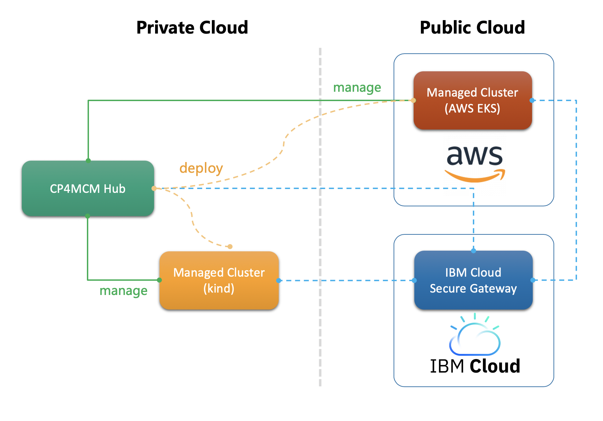

# Lab: All-in-One Playground to Manage Your Hybrid Cloud Using IBM Cloud Pak for Multicloud Management

## What Does This Lab Provide?

This lab will walk you through the steps to use IBM Cloud Pak for Multicloud Management (CP4MCM) to manage a
cluster on your local machine and a remote cluster on AWS, then deploy a sample application from hub cluster
to the two managed clusters.

## What Will You Learn From The Lab?

After you finish up this lab, you will have a better view of how CP4MCM can manage clusters and applications
from hub cluster to multiple management clusters which are two typical usage scenarios frequently being used
by CP4MCM users.

In this lab, you will also learn how CP4MCM manages clusters efficiently in hybrid environment with the help
of IBM Cloud Secure Gateway.

## Must Read Before You Launch The Lab

* See [Lab Instructions](docs/) for detailed lab instructions step by step.
* This lab is powered by [labs-magic](https://github.com/morningspace/labs-magic) which is a tool built on top of [demo-magic](https://github.com/paxtonhare/demo-magic), so the [Lab Instructions](docs/) written in Markdown can be
run interactively in terminal! To learn how to run this lab in a terminal, see [How to Run This Lab](HOWTO.md).
* In order to run this lab more efficiently, there are some specific tips, please read [Lab Specific Tips](TIPS.md) for more details.

