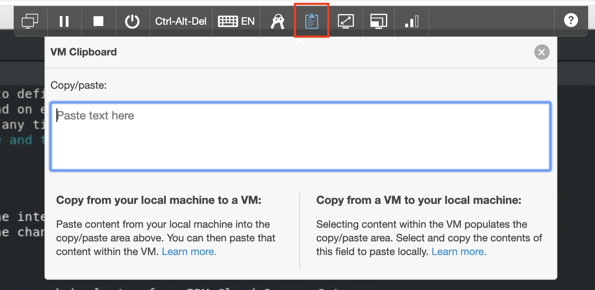

# Lab Specific Tips

Here are some tips that are specific to this lab and can help you run this lab more efficiently.

## Login to the lab

For Think lab students, there's a jumpbox that allows you to enter into the lab. To login to the lab via the
jumpbox, choose CL1-Master as the VM to login, and use the username/password: `ibmuser/passw0rd`.

## Lab VM clipboard

If you want to copy and paste text between your local machine and the lab VMs, you can use the lab VM clipboard.
This can be found on the lab toolbar docked on top of the lab environment window.

For example, to copy and paste text from local machine into lab VM. Paste the content from your local machine to
the copy/paste area. Then you can paste that content within the VM. As a known issue, if it doesn't work for the
first time, just try that a few more times. It should work.

## UI shortcuts

To explore CP4MCM UI, you can open the web browser by double clicking the Firefox icon on desktop, then find
a bookmark called "IBM Cloud Pak for Multicloud Management" on Bookmarks Bar. Click the bookmark to open the
login page, use credential `admin/Passw0rd!` to login CP4MCM. Note: you may need to click the bookmark again
after login in order to bring you to the CP4MCM welcome page.

There is also another bookmark for you to access the dashboard of IBM Cloud Secure Gateway Client, which can
be used to manage connections between the local network and internet. The bookmark is called "Secure Gateway
Client".

## Time consuming tasks

When you run [Task 2: Manage a cluster provisioned by AWS EKS](docs/task2/), usually it will take a bit long time to finish
the cluster provision process on AWS. After you finish kicking off the provision, you can go to run the next
task [Task 3: Manage a cluster provisioned by kind](docs/task3/), then go back and check the provision progress on AWS from
time to time until it is finished.

## IBM Cloud and AWS Accounts

In [Task 1: Configure hub cluster to be publicly accessible](docs/task1/) and [Task 2: Manage a cluster provisioned by AWS EKS](docs/task2/), you'll need
IBM Cloud account to setup IBM Cloud Secure Gateway and AWS account to provision AWS EKS clusters. If you do not have these
accounts, you can check with lab instructor, who will share you the trial accounts during the lab session on WebEx.