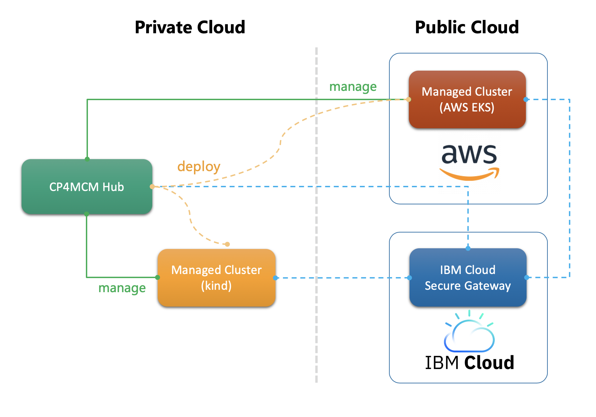

# IBM Cloud Pak for Multicloud Management: All-in-One Playground to Manage Your Hybrid Cloud

  Introduction
  ============

  This lab will walk you through the steps to use IBM Cloud Pak for Multicloud Management (CP4MCM) to manage a
  local cluster which is provisioned using kind and a remote cluster which is provisioned using AWS EKS, then
  deploy a sample application from hub cluster to the two managed clusters. This gives you a better view of how
  CP4MCM can manage clusters and applications in a hybrid environment easily.

  The lab also demonstrates the way to use IBM Cloud Secure Gateway to establish connections between hub cluster
  deployed in private network and managed cluster deployed on internet.

  
  
  Tasks
  =====

  0) [Prepare environment](task0/)
  1) [Configure hub cluster to be publicly accessible](task1/)
  2) [Manage a cluster provisioned by AWS EKS](task2/)
  3) [Manage a cluster provisioned by kind](task3/)
  4) [Deploy your first application through CP4MCM](task4/)

  Estimated time to complete: 60 min
