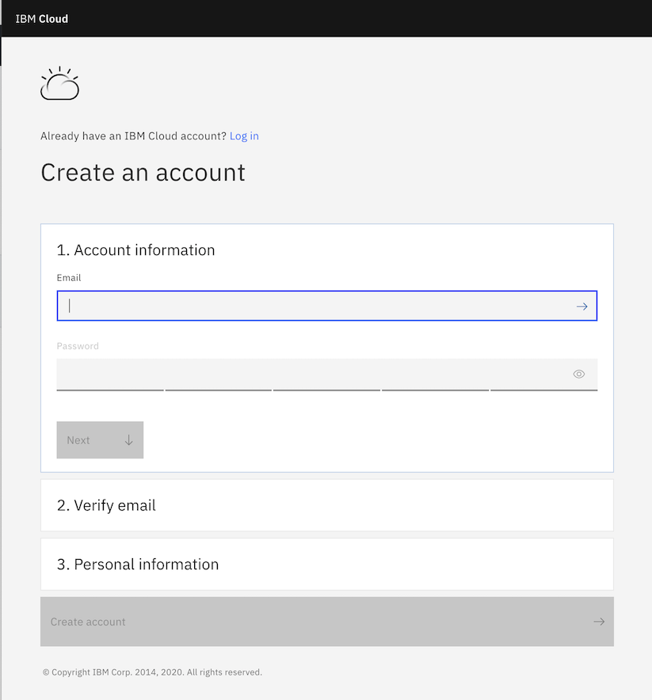
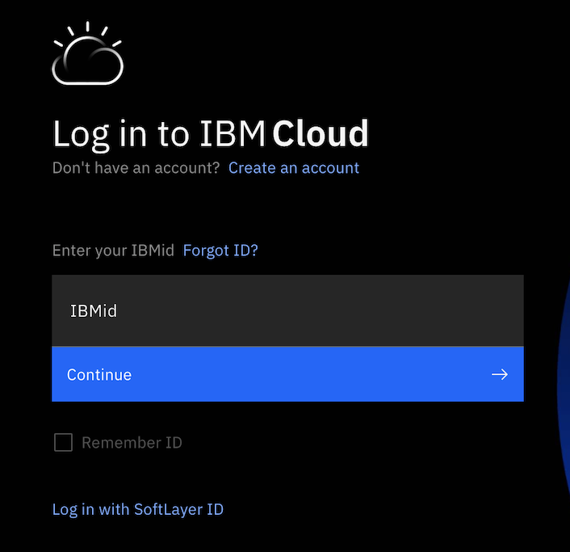
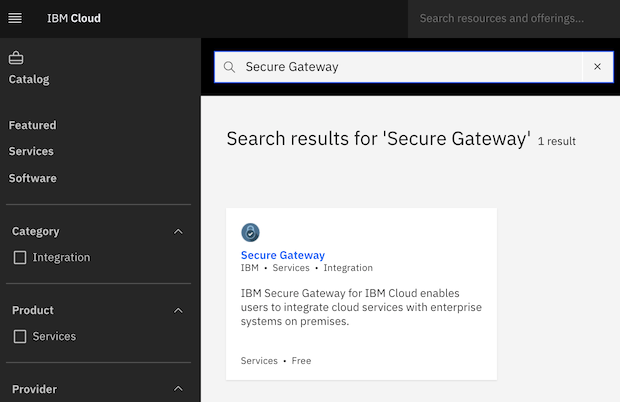
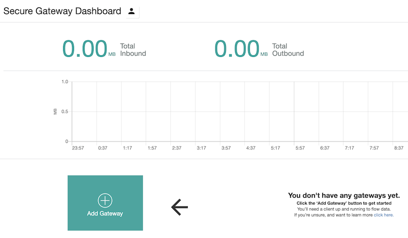
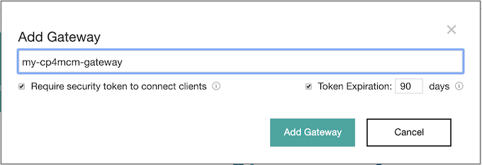
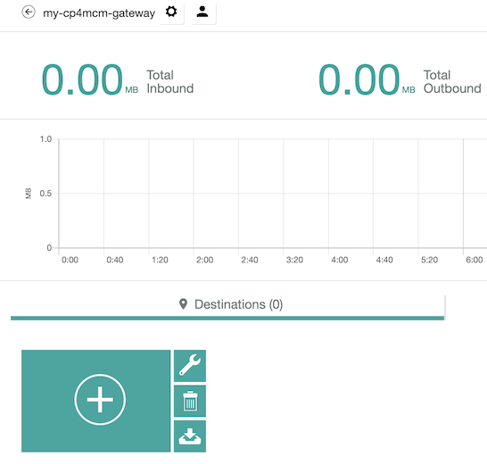

# Task 1 - Step 1: Configure Secure Gateway on IBM Cloud

Instructions
============

Please refer to below link to learn detail information to configure Secure Gateway using IBM Cloud account:
https://cloud.ibm.com/docs/services/SecureGateway?topic=securegateway-getting-started-with-sg&locale=en#getting-started-with-sg

In general, you may need to:

1) Login to IBM Cloud using your IBM Cloud account
2) Create a Secure Gateway resource
3) Add a gateway
4) Add a destination

---

## Login to IBM Cloud using your IBM Cloud account

If you do not have IBM Cloud account yet, you can sign up by yourself to register an account. Or, you can contact the lab instructor for any help.

To register an account, go to https://www.ibm.com/cloud, and click "Sign up or log in" button

Then on the sign up page, input your email address and password. IBM Cloud will send a verification code to you. Check your mail to find the code, input the code on the sign up page, and fill in the personal information, then create account.



After then, log in to IBM Cloud: https://cloud.ibm.com/ using your account.



## Create a Secure Gateway resource

Go to https://cloud.ibm.com/catalog, search by using keywords "Secure Gateway", you can see a service called "Secure Gateway" listed in the search results.



Click this service and go to its details page, then click the "Create" button at the bottom. The resource will be created then.

## Add a gateway

On the "Secure Gateway Dashboard" page, click the plus icon to add a gateway.



Give your gateway a name, e.g. my-cp4mcm-gateway and leave all the other fields without change.



## Add a destination

On the "Secure Gateway Dashboard" page, click the gateway that we created, then click the plus icon to add a destination for your gateway.



Answer the questions on the dialog wizard with below suggested values one by one:

```
1) Where is your resource located? On-Premises
2) What is the host and port of your destination? 
   Resource Hostname: $HOSTNAME
   Resource Port: 8443
3) What protocol will the User/Application use to connect to your destination? TCP
4) What kind of authentication does your destination enforce? None
5) If you would like to make your destination private, add IP table rules below. Just click Next
6) What would you like to name this destination? e.g. my-cp4mcm-destination
```

Here, $HOSTNAME is the host name of your host machine. You can get the value as below:

```shell
echo $HOSTNAME
```
