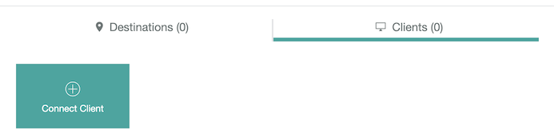
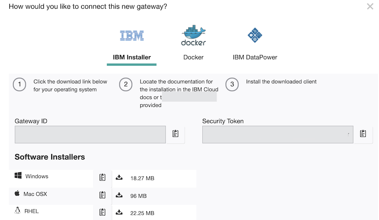

# Task 1 - Step 2: Launch and configure Secure Gateway Client from localhost

Instructions
============

Please refer to below link to learn details on how to configure Secure Gateway using your IBM Cloud account:
https://cloud.ibm.com/docs/services/SecureGateway?topic=securegateway-getting-started-with-sg&locale=en#getting-started-with-sg

In general, you may need to:

1) Launch Secure Gateway Client if not exists
2) Config Secure Gateway ACL for hub cluster

---

## Launch Secure Gateway Client

On the "Secure Gateway Dashboard" page, click the gateway that we created, click the Clients tab, then click the Connect Client button.



On the dialog, copy the Gateway ID and Security Token that will be used to launch the Secure Gateway Client



Let's save the Gateway ID and Security Token...

<!--
var::set-required "Gateway ID" "GATEWAY_ID"
var::set-required "Security Token" "GATEWAY_SECURITY_TOKEN"
var::save "GATEWAY_ID"
var::save "GATEWAY_SECURITY_TOKEN"
-->

Then, launch the client using the above Gateway ID and Security Token:

```shell
docker run -d -p 9003 --name gateway-client-${LAB_PROFILE} ibmcom/secure-gateway-client $GATEWAY_ID -t $GATEWAY_SECURITY_TOKEN
```

## Config Secure Gateway ACL for hub cluster

Secure Gateway Client has a dashboard which can be used to manage connections. We will use this dashboard to config ACL for our hub cluster.

The dashboard listens at port 9003 by default in the Docker container. We have exposed the port to the host machine when launched the container.

Run below command to get the host port for the dashboard:

```shell
DASHBOARD_PORT=$(docker inspect --format='{{(index (index .NetworkSettings.Ports "9003/tcp") 0).HostPort}}' gateway-client-${LAB_PROFILE})
echo $DASHBOARD_PORT
```

Go to: http://127.0.0.1:$DASHBOARD_PORT in web browser, click the "Access Control List" button, in the "Allow access" section, input:

```
1) Resource Hostname: $HOSTNAME
2) Port: 8443
```

Then click the plus icon. It allows the hub cluster deployed in your local network to be accessible from the internet.


Here, $HOSTNAME is the host name of your host machine. You can get the value as below:

```shell
echo $HOSTNAME
```
