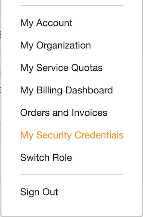

# Task 2 - Step 1: Get your AWS access key ID and secret access key

Instructions
============

If you already have an AWS account, you can follow the below steps to get your AWS access key ID and secret
access key, otherwise, you can contact the lab owner for access credentials:

Login to Amazon Console https://console.aws.amazon.com/ using your Amazon account. Click the user account on
top navigation bar and choose "My Security Credentials". Click the "Create access key" button to generate a
new access key ID and a secret access key for you. Record the two values for later use.



---

If you do not have AWS account yet, you can sign up by yourself to register a free account which should be sufficient for you to finish this lab.

Or, you can contact the lab owner for any help.

Then, save your AWS access key ID and secret access key...

<!--
var::set-required "Input AWS access key ID" "AWS_ACCESS_KEY_ID"
var::set-required "Input AWS secret access key" "AWS_SECRET_ACCESS_KEY"
var::save "AWS_ACCESS_KEY_ID"
var::save "AWS_SECRET_ACCESS_KEY"
-->

Then encode them into base64 strings...

```shell
printf $AWS_ACCESS_KEY_ID | base64
printf $AWS_SECRET_ACCESS_KEY | base64
```
