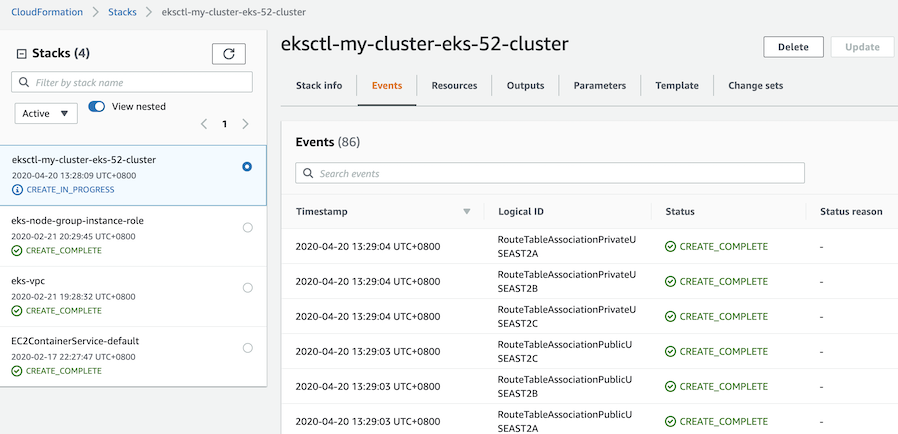

# Task 2 - Step 3: Track progress until the provision is finished

Instructions
============

During the provision, you can track the progress either on hub cluster or on AWS.

1) On hub cluster, you can monitor the logs of the pod created for the provision job.
2) On AWS, go to the link: https://console.aws.amazon.com/cloudformation. From the "Stacks" page, choose the
   right stack by the cluster name being used to provision your cluster, then go to its "Events" tab to find
   the progress.



---

To track the progress on hub cluster, let's find the pod at first and save to $CLUSTER_CREATE_JOB...

```shell
CLUSTER_CREATE_JOB=$(oc -n $LAB_NAMESPACE get pod -l="job-name=${AWS_CLUSTER_NAME}-create" | awk '{print $1}')
```
<!--
sleep 3
CLUSTER_CREATE_JOB=$(oc -n $LAB_NAMESPACE get pod -l="job-name=${AWS_CLUSTER_NAME}-create" | grep -e Running -e Completed -e ContainerCreating | awk '{print $1}')
-->

See what the value of $CLUSTER_CREATE_JOB is:

```shell
echo $CLUSTER_CREATE_JOB
```

Then, check the progress by monitoring the running pod logs...

```shell
oc -n $LAB_NAMESPACE logs $CLUSTER_CREATE_JOB
```

Please go to the next task or step if the cluster is provisioned. Before that, you can use this step to keep traking the provision progress.

Because the provision on AWS usually takes time, you can also go to the next task [Task 3: Manage a cluster provisioned by kind](../task3/README.md) and run that task simultaneously when the provision is ongoing, and go back to this step to keep traking the provision progress from time to time.
