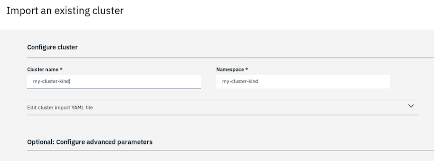
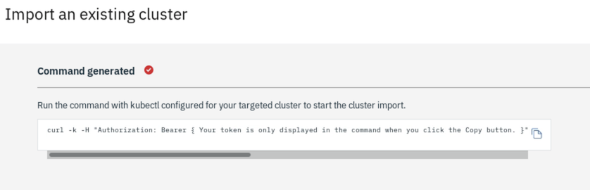

# Task 3 - Step 2: Generate the cluster import command from CP4MCM UI and run it

Instructions
============

To import an existing cluster into hub cluster, you can go to CP4MCM UI to generate the import command, then
run the command against your cluster to be imported. To import a local cluster launched by kind is very fast.
Usually, it takes a few minutes to finish.

---

## To generate the import cluster command from CP4MCM UI...

Open the link in your web browser: $CP4MCM_BASE_URL/multicloud/clusters


Here, $CP4MCM_BASE_URL is the pre-defined base URL for CP4MCM. You can set the value if not set yet, or print it as below:

```shell
echo $CP4MCM_BASE_URL
```

On the cluster list page, click the "Add cluster" button to open the popup dialog. Choose the option "Import an existing cluster by running a command on your cluster", then click the "Select" button.


On the next page, input the name of your cluster that is going to be imported, e.g. ${KIND_CLUSTER_NAME}, leave all the other fields without change



Then click the "Generate command" button to generate the command and copy it for later use.



<!--
var::set-required "Paste the import command here" "KIND_IMPORT_COMMAND"
var::save "KIND_IMPORT_COMMAND"
-->

The generated command uses `kubectl` and the default kubeconfig file in $HOME/.kube to apply the import YAML file.

Let's use `oc` and the kubeconfig for kind instead:

```shell
ACTUAL_IMPORT_COMMAND=${KIND_IMPORT_COMMAND%|*}
echo $ACTUAL_IMPORT_COMMAND
${ACTUAL_IMPORT_COMMAND}| oc apply --kubeconfig $HOME/.kube/kind-kubeconfig -f -
```

As above, we run the `oc` command by using the kubeconfig $HOME/.kube/kind-kubeconfig.
<!--
sleep 3
eval "${ACTUAL_IMPORT_COMMAND} -s | oc apply --kubeconfig $HOME/.kube/kind-kubeconfig -f - >/dev/null 2>&1"
-->
