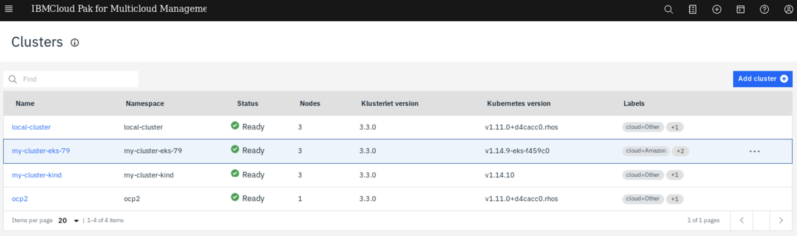

# Task 4: Deploy your first application through CP4MCM

Instructions
============

Before we start this task, we have provisioned two manged clusters:
1) One cluster on AWS Cloud in [Task 2: Manage a cluster provisioned by AWS EKS](../task2/README.md)
2) One cluster on local machine in [Task 3: Manage a cluster provisioned by kind](../task3/README.md)

By exploring CP4MCM UI, you should be able to see the two clusters are both in ready status:

In this task, we will deploy nginx as a sample application from hub cluster to the clusters that are managed
by the hub cluster using its application model via channel, subscription mechanism. We will use the clusters
that we provisioned before.

Steps:

1) [Define and apply an application](step1.md)
2) [Define and apply a channel](step2.md)
3) [Define and apply a subscription](step3.md)
4) [Define and apply a deployable](step4.md)
5) [Check results](step5.md)

Estimated time to complete: 15 min
